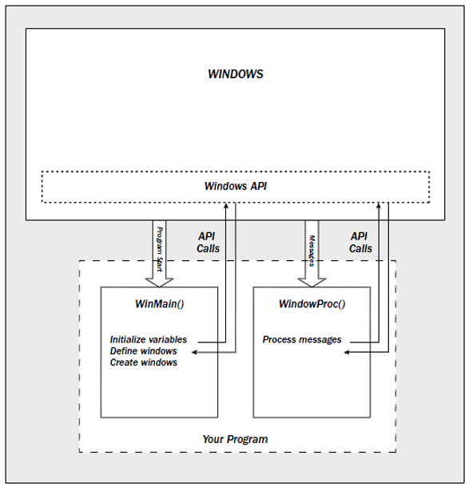

# การทดลองที่ 2 การสร้าง application ด้วย WIN32API

## Introduction

## ส่วนประกอบสำคัญ ในการพัฒนา Windows Apps

## The Structure of a Windows Program



## สิ่งที่ทำให้ Windows Application ทำงานได้ ประกอบด้วย 3 ส่วนหลักๆ ได้แก่

### Applications

- Application คือ code ที่ทำงาน (execute) ได้
- Application สามารถเก็บในไฟล์ที่แยกจากกันได้
    - .exe (executable file)
    - .dll (dynamic Link Library)
    - Activex
    - Device Drivers
- Application จะไม่เรียกใช้ Device driver โดยตรง  แต่ใช้งานผ่าน operating system

### Windows

Windows ในที่นี้ไม่ได้หมายถึงระบบปฏิบัติการ แต่เป็นกรอบหน้าต่างสี่เหลี่ยมที่ระบบปฏิบัติการสร้างขึ้น เพื่อ
แสดง controls เพื่อรวมรวมข้อมูลจากผู้ใช้

Windows ทำหน้าที่นำเสนอข้อมูลต่อผู้ใช้ โดย Windows จะเป็นส่วนหนึ่งของ Application ในแต่ละ Application สามารถมีได้หลาย windows

Operating system จะสื่อสารกับ windows ของ application ผ่าน message ของระบบ

เมื่อ windows ถูกสร้างขึ้นมา จะได้รับหมายเลขประจำตัว เรียกว่า window handle

### Messages and Events

Message เป็น object เล็กๆ ในระบบวินโดสว์ ถูกส่งไปมาระหว่าง process ต่างๆ ใน message ประกอบด้วย
- ```Time stamp``` (ใช้เป็นการภายใน OS เท่านั้น)
- ```messages identifier```
- ```wParam```   และ  ```lParam```  (เป็นข้อมูลที่ส่งมากับ message)
- ```Window handle``` ของหน้าต่างผู้รับ message

### message identifier

message identifier เป็นค่าคงที่ ที่รู้จักโดยทุก application ในระบบปฏิบัติการ Windows เช่น

|Messages|หน้าที่|
|--|--|
|WM_LBUTTONDOWN| เกิดขึ้นเมื่อมีการกดปุ่มซ้ายของเมาส์WM_KEYDOWN.   เกิดขึ้นเมื่อ มีการกดปุ่มใดๆ บนคีย์บอร์ด|
|WM_CHAR|    เกิดต่อจาก WM_KEYDOWN ประกอบด้วย  ASCII code ของอักษรที่กด <br>การกด function keys  และ arrow keys จะเกิด WM_KEYDOWN แต่ไม่มีWM_CHAR | 
|WM_PAINT| ถูกสร้างโดย operating system เมื่อต้องการ “refreshed” ส่วนต่างๆ ของหน้าต่าง  เมื่อต้องการ resized หรือเมื่อ window ที่อยู่ด้านบนถูกลบออกไป|

และอีกหลายๆ Message

### The application message queue

- เมื่อ application ถูกสร้างขึ้น มันจะสร้าง message queue ขึ้นมา เพื่อรองรับ การส่ง message มาจากระบบปฏิบัติการ
- เมื่อมีเหตุการณ์ต่างๆ เกิดขึ้น ระบบปฏิบัติการ  Windows จะใส่message  ลงใน application message queue 
- ระบบปฏิบัติการ  Windows จะรู้จักที่อยู่ของแต่ละ Application message queue เนื่องจากตอนสร้าง application จะต้องมีการ register กับระบบ

### The main message loop

หลังจาก Windows ใส่ message ลงใน message queue ของ application แล้ว application จะต้องไปดึง message เหล่านั้นมาพิจารณา ทุก message ตามลำดับที่มีถึง
- ทุก Application จะต้องเริ่มที่ Winmain เสมอ
- ใน Winmain จะมีส่วนของโปรแกรมที่ทำหน้าที่จัดการกับ message ที่เข้ามา

``` C++
while (GetMessage(&msg))
    DispatchMessage(&msg)
```

```GetMessage``` ดึง message ออกจาก Application message queue
```DispatchMessage``` ส่ง message ไปยัง window ปลายทาง

### MyWindowProc

ในฟังก์ชัน MyWindowProc(hwnd, message_identifier, wParam, lParam) จะประกอบด้วย code ที่ทำหน้าที่จ่ายงานให้กับ window ตาม message ที่รับเข้ามาจาก OS

``` C++
switch(message_identifier)
    { case WM_LBUTTONDOWN:
           /*  code to respond to this message */
           break;
      case WM_CHAR:
           /* code to respond to this message */
           break;
      case WM_PAINT:
           /* code to respond to this message */
           break;
       ...
    }
```

Flowchart ของการส่ง message ในระบบ windows


